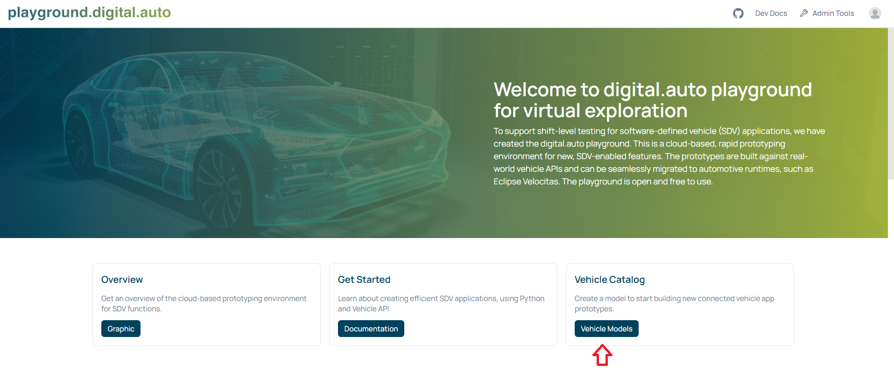
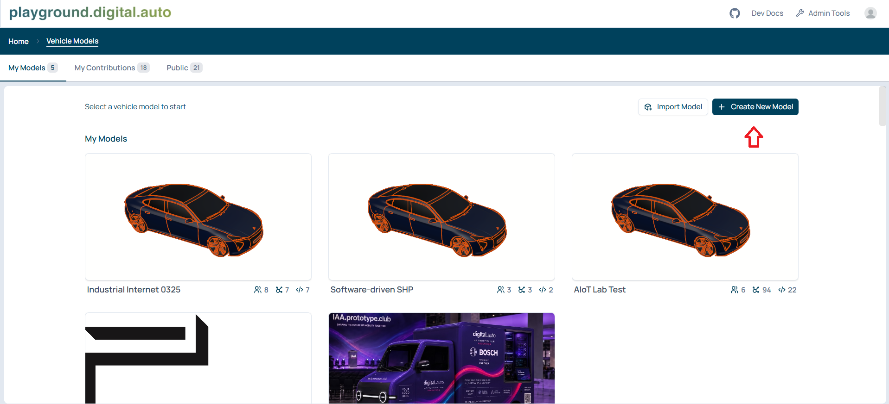
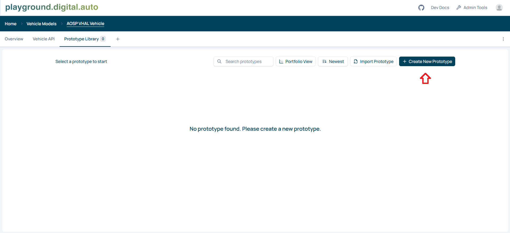
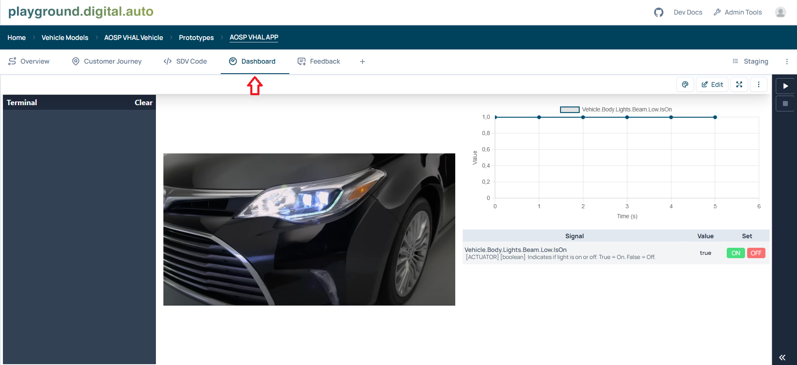
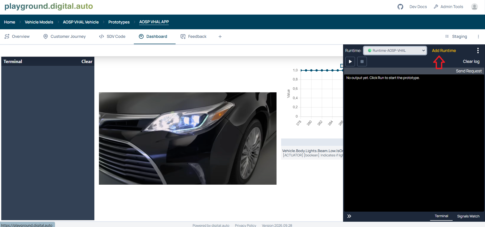
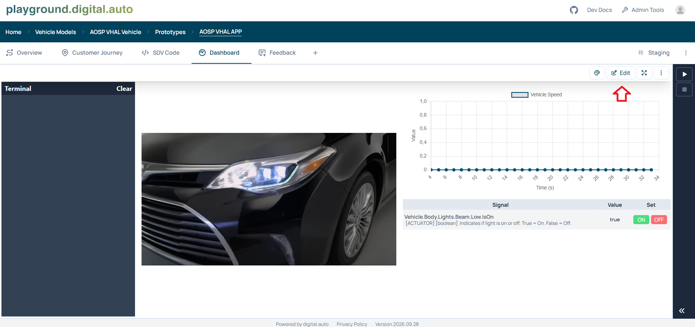
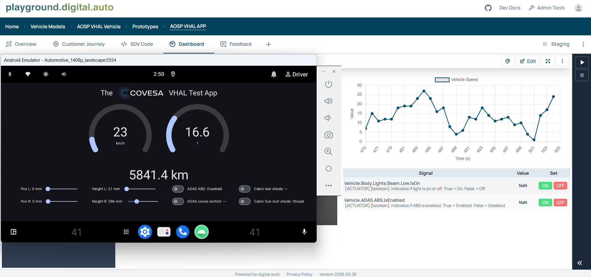

# Integrating AOSP with digital.auto

This tutorial uses a preconfigured AOSP environment with the Android COVESA Emulator, Android VHAL Test App, and Mock VHAL Server already running. It explains how to start the SDV Runtime and configure a Prototype in the digital.auto Playground to display speed synchronized with the Android VHAL Test App.

## 1. Check the prerequisites

Before you begin, confirm that:

- The Android Emulator is running, and the Android VHAL test app is installed and working.
- Docker is installed and running on the host that will run the Runtime. Running `docker info` should return Docker server information.
- The host can access the container registry and digital.auto services, and host port `55556` is available.

Keep the Emulator, test app, and Mock VHAL Server running. Execute the following commands in a terminal on the Docker host.

## 2. Start the SDV Runtime

Use the following command, replacing `MyRuntimeName` with your preferred Runtime name:

```sh
docker run -d --restart=always -e RUNTIME_NAME="MyRuntimeName" -p 55556:55555 ghcr.io/eclipse-autowrx/sdv-runtime:latest
```

For example, to name the Runtime `AOSP-VHAL`:

```sh
docker run -d --restart=always -e RUNTIME_NAME="AOSP-VHAL" -p 55556:55555 ghcr.io/eclipse-autowrx/sdv-runtime:latest
```

These are a template and an example: **run only one of them**. Docker downloads the image if it is not available locally. Once the container starts, the terminal returns its container ID. Save this ID so you can check its status and logs.

| Option | Description |
| --- | --- |
| `-d` | Runs the container in the background. |
| `--restart=always` | Enables automatic restarts. After a manual stop, the container starts again when the Docker daemon restarts or when you start it manually. |
| `-e RUNTIME_NAME="AOSP-VHAL"` | Sets the Runtime name. Replace it with your preferred name. |
| `-p 55556:55555` | Maps host port `55556` to port `55555` inside the container. |
| `ghcr.io/eclipse-autowrx/sdv-runtime:latest` | Specifies the SDV Runtime image. |

### Required port mapping

Docker uses the format `-p HOST_PORT:CONTAINER_PORT`. For this setup, use:

```text
Host port 55556 -> SDV Runtime container port 55555
```

**The port before the colon must be `55556`, not `55555`. Keep the port after the colon set to `55555`. Do not use `55555:55555` for this setup.** This gives the Runtime a separate host port and avoids a conflict with any existing service using host port `55555`. The Mock VHAL Server's actual listening port depends on your project configuration.

Port `55555` inside the Runtime exposes the Kuksa Databroker. A client running directly on the same Docker host should connect to `localhost:55556`. This is the Databroker endpoint, not the Playground web address or the Mock VHAL Server endpoint. See the [official SDV Runtime repository](https://github.com/eclipse-autowrx/sdv-runtime) for Runtime and port details.

## 3. Verify that the container is running

List running containers:

```sh
docker ps
```

Find the container ID returned in the previous step and check that:

- `IMAGE` is `ghcr.io/eclipse-autowrx/sdv-runtime:latest`.
- `STATUS` shows `Up`.
- `PORTS` includes `55556->55555/tcp`, for example, `0.0.0.0:55556->55555/tcp`.

To inspect the logs, replace `CONTAINER_ID` with the actual container ID:

```sh
docker logs --tail 100 CONTAINER_ID
```

If the container does not appear in `docker ps`, run `docker ps -a` to check whether it exited, then inspect its logs. An `Up` status confirms that the container is running; you still need to confirm that the Runtime is available in the Playground.

## 4. Set up the Playground

Follow this sequence: sign in, create a vehicle model, create a prototype, add the Runtime, and configure a Chart widget for `Vehicle.Speed`.

The UI labels below follow the documented Playground workflow. Some labels and panel positions may differ between Playground versions.

### 4.1. Create an account or sign in

Open the [digital.auto Playground](https://playground.digital.auto/). Make sure you have a Playground account and are signed in before creating a model. If you do not have an account, use the registration or GitHub sign-in option offered on the login page and complete the prompts.



### 4.2. Create a vehicle model

1. Open the vehicle model list and click **Create New Model**.
2. Enter a name, for example, `AOSP VHAL Vehicle`.
3. Select a VSS/API catalog compatible with your backend. It must contain `Vehicle.Speed`.
4. Choose the intended visibility: **Private** for your own work, or **Public** if you want to share the model.
5. Create the model and open it.

The vehicle model holds the API catalog and the prototypes that use it.



### 4.3. Create a prototype

1. Inside the model, open the **Prototype Library**.
2. Click **+ New Prototype** and enter a name such as `AOSP VHAL APP`.
3. Create and open the prototype, then select its **Dashboard** tab.

You will use this prototype's Dashboard to display speed values from the Runtime.




### 4.4. Add and select the Runtime

Keep the Docker container from section 2 running while completing these steps.

1. In the prototype's **Dashboard** tab, expand the terminal panel.
2. Click **Add runtime**.
3. Enter the Runtime ID. With `RUNTIME_NAME="AOSP-VHAL"` and the default prefix, enter:

   ```text
   Runtime-AOSP-VHAL
   ```

4. Click **Add**, then close the dialog.
5. Once the Runtime list refreshes, select `Runtime-AOSP-VHAL` from the Runtime selector.
6. Confirm that the selected Runtime is online.

Adding the Runtime is only needed once. If it is already listed, select the existing entry. The Runtime ID is a name, so do not enter `localhost:55556` in the name field. If you configured a custom Runtime prefix, use the resulting ID from your container logs.




### 4.5. Add a Chart widget to the Dashboard

1. In the prototype's **Dashboard** view, click **Edit**.
2. Edit Widget **Chart Signal Widget** (the Chart widget).
3. Open the widget's **Options** editor and replace its options with the following JSON:

   ```json
      {
          "api": "Vehicle.Speed",
          "lineColor": "#005072",
          "dataUpdateInterval": "1000",
          "maxDataPoints": "30"
      }
   ```

4. Apply/save the widget configuration and save the prototype if prompted.

Paste this JSON into the selected widget's options, not into an editor expecting the complete dashboard layout. The configuration uses the exact, case-sensitive API path `Vehicle.Speed`, sets `dataUpdateInterval` to `1000`, and retains up to 30 data points.



### 4.6. Add the speed reader in the Code tab and run it

1. Open the Prototype's **SDV Code** tab.
2. Replace the example code with the following complete Python program. It uses the `VehicleApp` structure and reads `Vehicle.Speed` so that the speed supplied by AOSP remains available.

```python
import asyncio
import math
import random
import signal

from sdv.vehicle_app import VehicleApp
from vehicle import Vehicle, vehicle


class TestApp(VehicleApp):

    def __init__(self, vehicle_client: Vehicle):
        super().__init__()
        self.Vehicle = vehicle_client

    async def on_start(self):
        while True:
            value = (await self.Vehicle.Speed.get()).value
            print(f"Vehicle.Speed: {value}")
            await asyncio.sleep(0.5)

async def main():
    vehicle_app = TestApp(vehicle)
    await vehicle_app.run()


LOOP = asyncio.get_event_loop()
LOOP.add_signal_handler(signal.SIGTERM, LOOP.stop)
LOOP.run_until_complete(main())
LOOP.close()
```

3. Save the code and select the online `Runtime-AOSP-VHAL` Runtime.
4. Click **Run** (the triangle button). Run this program on the SDV Runtime, which provides the required Python modules.
5. Check the terminal for repeated `Vehicle.Speed: ...` output. If the program exits with an error, resolve that error before checking the chart.
6. Open **Dashboard** and **Signals Watch** in the Runtime panel. Change the speed using your existing Android VHAL Test App or Mock VHAL Server controls, then compare the terminal output, Signals Watch, and chart with the Emulator. Account for any configured unit conversion and update delay.
7. Click **Stop** when finished; the reader otherwise continues running.

The Playground subscribes to the APIs detected in the Prototype's code and widget configuration, matched against the vehicle model's API catalog. Values pass through the Runtime's syncer and Kit Server to the browser, then to the widget. Selecting a Runtime and configuring a chart are therefore setup steps; confirm reception in Signals Watch before considering synchronization complete.



## 5. Troubleshooting

| Symptom | What to check |
| --- | --- |
| Docker reports that the port is already allocated | Confirm that the command uses `-p 55556:55555`. Run `docker ps` to check whether an existing Runtime already uses port `55556`. If the existing container is working, you do not need to run `docker run` again. |
| The container exits or keeps restarting | Use `docker ps -a` and `docker logs --tail 100 CONTAINER_ID` to inspect its status and error messages. |
| The Runtime does not appear in the Playground | Check the Runtime name and default prefix, inspect the container logs, and confirm that the container can reach digital.auto services. |
| The Chart widget is empty | Complete section 4.6: save the speed reader, select the online Runtime, and click Run. Check the terminal for errors. Also confirm that `Vehicle.Speed` exists in the model, that the widget options set `api` to `Vehicle.Speed`, and that the widget configuration has been saved. |
| Databroker values change, but `Vehicle.Speed` is missing from Signals Watch | Confirm that the model's API catalog contains `Vehicle.Speed` and that the saved widget configuration references that exact path. Reload the Prototype and reselect the intended Runtime. |
| `Vehicle.Speed` appears in Signals Watch but has no live value | Check that the selected Runtime is the same container whose Databroker you inspected. In browser developer tools, inspect the Kit Server Socket.IO traffic: `subscribe_apis` should include `Vehicle.Speed`, and `apis-value` replies should contain its changing value. Check the syncer connection and container logs if replies are missing. |
| Signals Watch updates correctly, but the chart does not | Focus on the Chart Signal Widget's saved options and browser Console errors. The data has reached the Playground, so inspect the widget and its value delivery rather than changing the AOSP connection. |
| The chart changes, but does not match AOSP speed | Confirm that the intended Runtime is selected and the widget uses `Vehicle.Speed`. Compare the displayed units and check that the Android VHAL Test App and Mock VHAL Server are still communicating. |
| The Runtime is online, but AOSP data does not change | Confirm that the Emulator, Android VHAL Test App, and Mock VHAL Server are still running. Check the Runtime container logs for connection errors. |